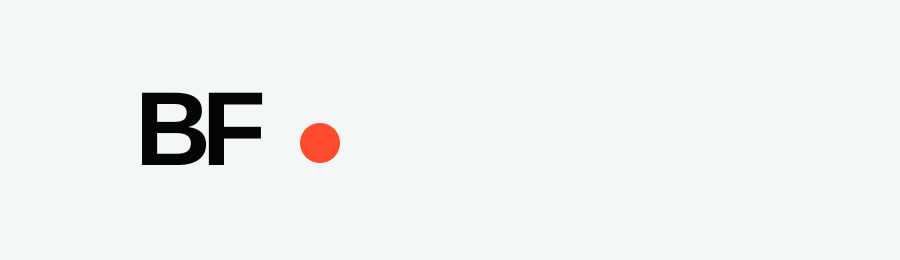

<h1 align="center">Bernardo Franco — Creative Portfolio</h1>

<strong>Visual storytelling · audiovisual production · creative direction</strong>

<a href="https://bernardofrancoe.com/"><strong>Live website</strong></a>

A responsive portfolio designed and developed to present Bernardo Franco's audiovisual and creative work through a clean, project-led visual experience.

| Project portfolio | Video integration | Visual design | Responsive experience |
|---|---|---|---|
| Individual case pages | Photography + audiovisual media | Custom UI/UX | Desktop + mobile |

### Selected work
CENIZA · Amigos Vinilos · Super Rayo · Tu Plon Stereo · Podcast Introcrea

### Tech stack
   

<strong>Repository structure</strong>

~~~text
index.html       Main portfolio
styles.css       Responsive UI
script.js        Main interactions
project.html     Project experience
project.css      Project styling
project.js       Project interactions
assets/          Brand and project media
~~~

<strong>Production:</strong> https://bernardofrancoe.com/

Design and development by <strong>Diego Franco</strong>.

