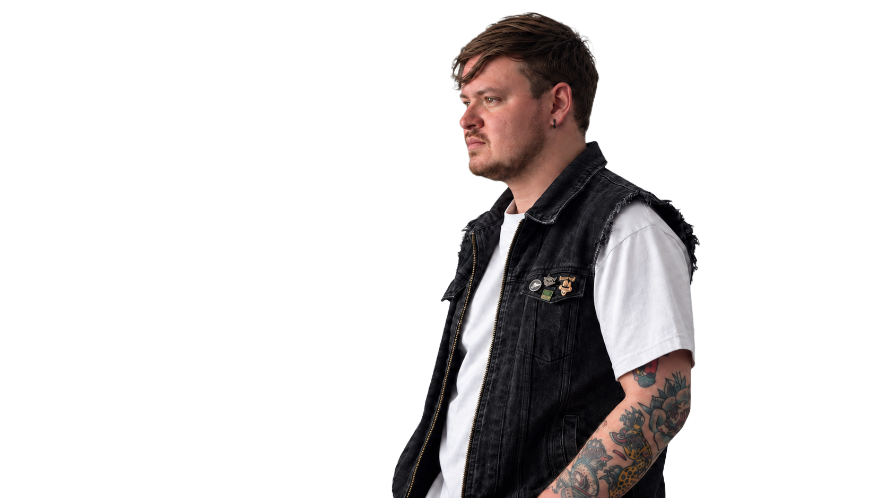

# Bernardo Franco — Creative Portfolio

**Visual storytelling · audiovisual production · creative direction**

**Live website:** https://bernardofrancoe.com/

Responsive portfolio website designed and developed to present Bernardo Franco's audiovisual and creative work through a project-led visual experience.

## What it includes

- Responsive portfolio landing page.
- Individual project pages and visual case studies.
- Image, video and behind-the-scenes media.
- Custom UI/UX focused on visual storytelling.
- Responsive composition for desktop and mobile.
- SEO files, sitemap and production deployment.

## Selected work

The site brings together audiovisual projects including CENIZA, Amigos Vinilos, Super Rayo, Tu Plon Stereo, Podcast Introcrea and other creative work.

## Build

HTML · CSS · JavaScript

~~~text
index.html       Main portfolio
styles.css       Global responsive UI
script.js        Main interactions
project.html     Project view
project.css      Project styling
project.js       Project interactions
assets/          Portraits and project media
~~~

## Production

**https://bernardofrancoe.com/**

Design and development by **Diego Franco**.
